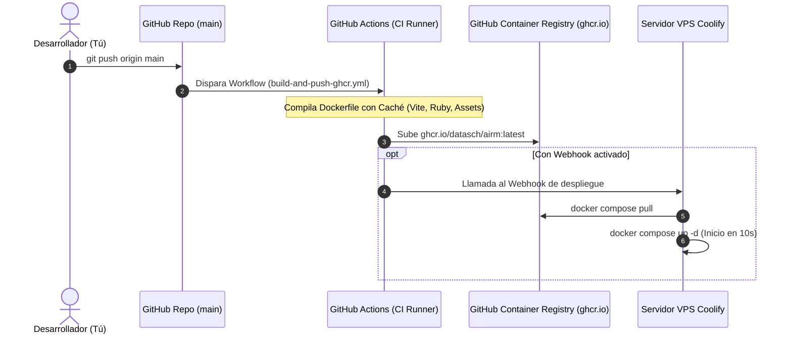

# 🚀 Guía de CI/CD: GitHub Actions + GitHub Container Registry (GHCR) + Coolify

Esta arquitectura permite que **GitHub compile y empaquete la imagen de AIRM en sus servidores de alta velocidad (con caché)** y la publique en `ghcr.io/datasch/airm:latest`. 

Tu VPS con **Coolify solo descargará la imagen lista en ~5-10 segundos** y levantará los servicios sin consumir CPU ni RAM compilando assets ni gemas en tu servidor.

---

## 🔄 Flujo de Trabajo Automatizado



---

## 🛠️ Paso 1: Configurar Visibilidad del Paquete en GitHub (Una sola vez)

Cuando GitHub Actions suba la primera imagen a GHCR por primera vez:

1. Ve a tu perfil de GitHub: **https://github.com/datasch?tab=packages**
2. Haz clic en el paquete **`airm`**.
3. Ve a **Package settings** (en la columna lateral derecha).
4. Baja hasta la sección **Danger Zone** y en **Change visibility** selecciona **Public**.
5. *¡Listo!* Al ser público, Coolify puede descargar la imagen directamente sin requerir tokens de autenticación adicionales.

> **Nota (Si prefieres mantener el paquete Privado):**
> En Coolify ve a **Sources / Registries** > **+ Add Registry** > Selecciona **GitHub Container Registry (`ghcr.io`)**, ingresa tu usuario `datasch` y un GitHub Personal Access Token (PAT) con permiso `read:packages`.

---

## 🤖 Paso 2: Despliegue Automático con Webhook de Coolify (Opcional)

Para que Coolify se actualice **100% en automático** cada vez que termine la compilación en GitHub:

1. En tu panel de **Coolify**, entra a la aplicación **AIRM**.
2. Ve a la pestaña **`Webhooks`** en el menú superior.
3. Copia la URL que aparece en **Deploy Webhook** (ejemplo: `https://s3.giantucchi.com/api/v1/deploy?uuid=...`).
4. Ve a tu repositorio en GitHub: **https://github.com/datasch/AIRMv2/settings/secrets/actions**
5. Haz clic en **New repository secret**:
   * **Name**: `COOLIFY_WEBHOOK_URL`
   * **Secret**: Pega la URL del Webhook copiada de Coolify.
6. Haz clic en **Add secret**.

---

## 📦 Paso 3: Configurar Coolify con el Docker Compose Optimizado

En tu panel de Coolify (en el recurso de AIRM):

1. En la sección **Docker Compose content**, asegúrate de que use la imagen de GHCR (ya configurada en `docker-compose.prod.yaml`):

```yaml
version: '3.8'

services:
  rails:
    image: ghcr.io/datasch/airm:latest
    restart: always
    environment:
      - RAILS_ENV=production
      - NODE_ENV=production
      - RAILS_SERVE_STATIC_FILES=true
      - SECRET_KEY_BASE=${SECRET_KEY_BASE}
      - FRONTEND_URL=${FRONTEND_URL:-http://localhost:3000}
      - HELPCENTER_URL=${HELPCENTER_URL:-}
      - POSTGRES_DATABASE=${POSTGRES_DATABASE:-chatwoot_production}
      - POSTGRES_HOST=postgres
      - POSTGRES_USERNAME=${POSTGRES_USERNAME:-postgres}
      - POSTGRES_PASSWORD=${POSTGRES_PASSWORD:-postgres}
      - REDIS_URL=redis://default:${REDIS_PASSWORD:-redispassword}@redis:6379/0
      - GOWA_URL=http://gowa:3000
      - GOWA_PUBLIC_URL=${GOWA_PUBLIC_URL:-http://localhost:3030}
      - ACTIVE_RECORD_ENCRYPTION_PRIMARY_KEY=${ACTIVE_RECORD_ENCRYPTION_PRIMARY_KEY}
      - ACTIVE_RECORD_ENCRYPTION_DETERMINISTIC_KEY=${ACTIVE_RECORD_ENCRYPTION_DETERMINISTIC_KEY}
      - ACTIVE_RECORD_ENCRYPTION_KEY_DERIVATION_SALT=${ACTIVE_RECORD_ENCRYPTION_KEY_DERIVATION_SALT}
      - MAILER_SENDER_EMAIL=${MAILER_SENDER_EMAIL:-AIRM <soporte@giantucchi.com>}
    volumes:
      - storage_data:/app/storage
    depends_on:
      postgres:
        condition: service_healthy
      redis:
        condition: service_healthy
    ports:
      - "${PORT:-3000}:3000"
    healthcheck:
      test: ["CMD-SHELL", "curl -f http://localhost:3000/health_check || exit 1"]
      interval: 30s
      timeout: 10s
      retries: 3

  sidekiq:
    image: ghcr.io/datasch/airm:latest
    restart: always
    command: ["bundle", "exec", "sidekiq", "-C", "config/sidekiq.yml"]
    environment:
      - RAILS_ENV=production
      - NODE_ENV=production
      - SECRET_KEY_BASE=${SECRET_KEY_BASE}
      - FRONTEND_URL=${FRONTEND_URL:-http://localhost:3000}
      - POSTGRES_DATABASE=${POSTGRES_DATABASE:-chatwoot_production}
      - POSTGRES_HOST=postgres
      - POSTGRES_USERNAME=${POSTGRES_USERNAME:-postgres}
      - POSTGRES_PASSWORD=${POSTGRES_PASSWORD:-postgres}
      - REDIS_URL=redis://default:${REDIS_PASSWORD:-redispassword}@redis:6379/0
      - GOWA_URL=http://gowa:3000
      - ACTIVE_RECORD_ENCRYPTION_PRIMARY_KEY=${ACTIVE_RECORD_ENCRYPTION_PRIMARY_KEY}
      - ACTIVE_RECORD_ENCRYPTION_DETERMINISTIC_KEY=${ACTIVE_RECORD_ENCRYPTION_DETERMINISTIC_KEY}
      - ACTIVE_RECORD_ENCRYPTION_KEY_DERIVATION_SALT=${ACTIVE_RECORD_ENCRYPTION_KEY_DERIVATION_SALT}
    volumes:
      - storage_data:/app/storage
    depends_on:
      postgres:
        condition: service_healthy
      redis:
        condition: service_healthy

  gowa:
    image: aldinokemal2104/go-whatsapp-web-multidevice:latest
    restart: always
    command: ["rest"]
    environment:
      - CHATWOOT_ENABLED=true
      - CHATWOOT_URL=http://rails:3000
    volumes:
      - gowa_data:/app/storages
    ports:
      - "${GOWA_PORT:-3030}:3000"

  postgres:
    image: pgvector/pgvector:pg16
    restart: always
    environment:
      - POSTGRES_DB=${POSTGRES_DATABASE:-chatwoot_production}
      - POSTGRES_USER=${POSTGRES_USERNAME:-postgres}
      - POSTGRES_PASSWORD=${POSTGRES_PASSWORD:-postgres}
    volumes:
      - postgres_data:/var/lib/postgresql/data
    healthcheck:
      test: ["CMD-SHELL", "pg_isready -U ${POSTGRES_USERNAME:-postgres} -d ${POSTGRES_DATABASE:-chatwoot_production}"]
      interval: 10s
      timeout: 5s
      retries: 5

  redis:
    image: redis:alpine
    restart: always
    command: ["redis-server", "--requirepass", "${REDIS_PASSWORD:-redispassword}"]
    volumes:
      - redis_data:/data
    healthcheck:
      test: ["CMD", "redis-cli", "-a", "${REDIS_PASSWORD:-redispassword}", "ping"]
      interval: 10s
      timeout: 5s
      retries: 5

volumes:
  postgres_data:
  redis_data:
  storage_data:
  gowa_data:
```

---

## 🚀 Cómo Desplegar de Ahora en Adelante

1. Haces tus cambios en tu máquina local.
2. Haces commit y push a `main`:
   ```bash
   git add .
   git commit -m "feat: nueva mejora"
   git push origin main
   ```
3. **GitHub Actions** compilará la imagen en la nube automáticamente en la pestaña **Actions** de tu GitHub (`https://github.com/datasch/AIRMv2/actions`).
4. Si configuraste el Webhook del Paso 2, **Coolify se desplegará solo**. Si no, simplemente presionas el botón **Deploy** en Coolify y en **10 segundos** tu aplicación estará en línea y actualizada.
