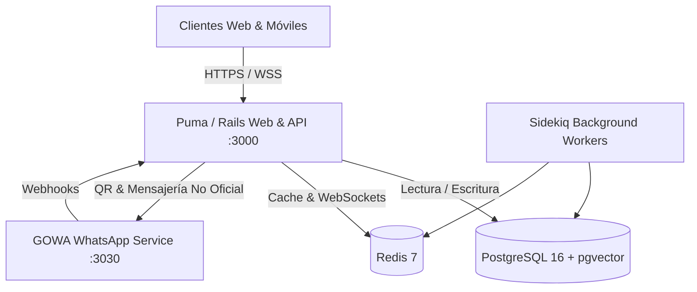

<!-- cspell:disable -->
# 🚀 AIRM by Giantucchi

<p align="center">
  
</p>

<p align="center">
  <strong>Plataforma Integral de AI Relationship Management (AIRM), CRM Conversacional y Automatizaciones Omnicanal</strong>
</p>

<p align="center">
  
  
  
  
  
  
</p>

---

## 🌟 Descripción General

**AIRM by Giantucchi** es una plataforma soberana de gestión de relaciones con clientes (CRM) y atención omnicanal potenciada por Inteligencia Artificial. Diseñada para equipos de ventas, marketing y soporte técnico que buscan centralizar todas sus conversaciones en una única bandeja colaborativa, calificar prospectos en automático y cerrar más tratos sin fricción.

Cuenta con la edición **Enterprise totalmente desbloqueada**, integración nativa con **WhatsApp No Oficial vía código QR (GOWA)**, pasarela oficial **Meta Cloud API**, **Landing Page de presentación** y configuración lista para producción en **Coolify**.

---

## ✨ Características Principales

### 📱 1. Omnicanalidad Completa y WhatsApp Multidispositivo
* **WhatsApp No Oficial (GOWA QR)**: Vinculación instantánea escaneando un código QR desde WhatsApp en tu teléfono, sin trámites ni aprobaciones complejas.
* **WhatsApp Business Oficial (Meta Cloud API)**: Para envíos masivos oficiales y plantillas verificadas.
* **Instagram Direct Messages**: Recepción y respuesta a mensajes directos y menciones en historias.
* **Facebook Messenger**: Gestión unificada de páginas comerciales.
* **Telegram Bot API**: Canales y grupos de atención directa.
* **Live Chat WebWidget**: Widget personalizable para sitios web y aplicaciones móviles con soporte en tiempo real.
* **Correo Electrónico**: Bandejas de entrada bidireccionales con soporte SMTP/IMAP y enrutamiento inteligente.

### 🤖 2. Agentes de IA & Automatizaciones Autónomas
* **Copilotos de IA 24/7**: Respuestas contextuales basadas en base de conocimientos, catálogos o manuales de soporte.
* **Calificación Automática de Leads**: Detección en tiempo real de intención de compra, sentimiento y presupuesto del cliente.
* **Macros y Reglas de Automatización**: Asignación automática por Round-Robin, etiquetado inteligente y alertas por eventos.

### 📊 3. Pipeline CRM y Gestión Comercial Kanban
* **Tableros Visuales**: Seguimiento del estado de los prospectos (Nuevos, En Proceso, Calificados, Negociación, Cerrados).
* **Campos Personalizados**: Atributos personalizados para clientes y empresas.
* **Reportes y Analíticas**: Tiempos de primera respuesta (FRT), volumen de conversaciones y rendimiento por agente.

### 🏢 4. Capacidades Enterprise Desbloqueadas
* Multi-agentes y multi-cuentas sin límites de cuota artificiales.
* Registro de auditoría y reportes avanzados.
* Módulos de videollamadas integradas (Cloudflare RealtimeKit).
* Asignación de roles y permisos personalizados por equipo (Ventas, Soporte, Finanzas).

### 🌐 5. Landing Page de Presentación
* Página web de inicio moderna en la raíz (`/`) con estética oscura, gradientes de neón y simulación interactiva en tiempo real.
* Acceso directo para usuarios registrados en `/app/login` y panel de administración en `/app`.

---

## 🏗️ Arquitectura de Servicios

El sistema se compone de 5 microservicios orquestados:



---

## 🚀 Despliegue Rápido

### Opción A: Despliegue en Producción con Coolify (Recomendado)

1. En tu panel de **Coolify**, crea un nuevo recurso tipo **Docker Compose**.
2. Copia y pega el contenido del archivo [`docker-compose.prod.yaml`](docker-compose.prod.yaml).
3. En la pestaña **Environment Variables**, configura las variables según el archivo [`.env.production.example`](.env.production.example):
   ```env
   SECRET_KEY_BASE=tu_clave_secreta_64_caracteres
   FRONTEND_URL=https://app.tu-dominio.com
   GOWA_PUBLIC_URL=https://gowa.tu-dominio.com
   POSTGRES_PASSWORD=tu_password_postgres
   REDIS_PASSWORD=tu_password_redis
   ACTIVE_RECORD_ENCRYPTION_PRIMARY_KEY=tu_clave_hex_32_bytes
   ACTIVE_RECORD_ENCRYPTION_DETERMINISTIC_KEY=tu_clave_hex_32_bytes
   ACTIVE_RECORD_ENCRYPTION_KEY_DERIVATION_SALT=tu_clave_hex_32_bytes
   ```
4. Asigna tu dominio en Coolify y presiona **Deploy**.

---

### Opción B: Ejecución Local en Desarrollo

1. **Clonar el repositorio**:
   ```bash
   git clone https://github.com/datasch/AIRMv2.git
   cd AIRMv2
   ```

2. **Levantar los servicios con Docker Compose**:
   ```bash
   docker compose up -d
   ```

3. **Ejecutar migraciones y datos iniciales**:
   ```bash
   docker exec -it chatwoot-rails-1 bundle exec rails db:chatwoot_prepare
   ```

4. **Acceder a la plataforma**:
   * Landing de presentación: `http://localhost:3000/`
   * Inicio de sesión: `http://localhost:3000/app/login`
   * Super Administrador: `http://localhost:3000/super_admin`
   * Microservicio WhatsApp (GOWA): `http://localhost:3030`

---

## 🔒 Variables de Entorno Clave

| Variable | Descripción | Valor por Defecto / Ejemplo |
| :--- | :--- | :--- |
| `FRONTEND_URL` | URL pública de la aplicación | `https://app.giantucchi.com` |
| `GOWA_URL` | URL interna del servicio GOWA | `http://gowa:3000` |
| `GOWA_PUBLIC_URL` | URL pública para la pasarela de WhatsApp | `https://gowa.giantucchi.com` |
| `INSTALLATION_NAME`| Nombre de la plataforma | `AIRM by Giantucchi` |
| `BRAND_NAME` | Nombre de marca | `AIRM` |
| `BRAND_URL` | Sitio web oficial | `https://giantucchi.com` |

---

## 🛠️ Stack Tecnológico

* **Backend**: Ruby on Rails 7.1, Puma, Sidekiq, Devise Token Auth.
* **Frontend**: Vue.js 3, Vite, Tailwind CSS, Pinia / Vuex.
* **WhatsApp Gateway**: Go (GOWA Multi-device WhatsApp Web).
* **Bases de Datos**: PostgreSQL 16 con extensión `pgvector` y Redis 7 Alpine.
* **Contenedores**: Docker multi-stage builds optimizados para producción.

---

## 📄 Licencia y Créditos

Desarrollado y mantenido por **[Giantucchi](https://giantucchi.com)**.
© 2026 Giantucchi. Todos los derechos reservados.
