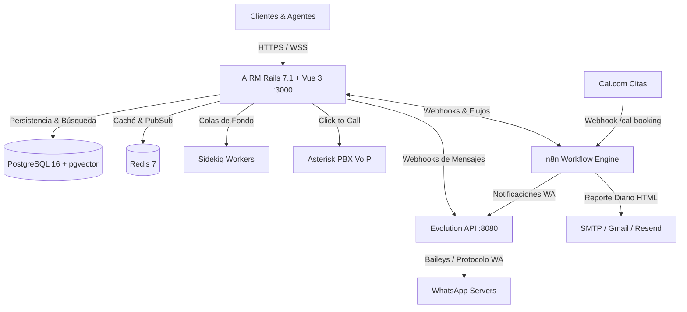

<!-- cspell:disable -->
# 🚀 AIRM by Giantucchi (AI Relationship Management)

<p align="center">
  
</p>

<p align="center">
  <strong>Plataforma Integral de AI Relationship Management (AIRM), CRM Omnicanal, Telefonía VoIP y Automatizaciones Inteligentes</strong>
</p>

<p align="center">
  
  
  
  
  
  
  
  
</p>

---

## 🌟 Descripción General

**AIRM by Giantucchi** es una plataforma soberana de gestión de relaciones con clientes (CRM), atención omnicanal y telefonía VoIP potenciada por Inteligencia Artificial y motores de automatización. Diseñada para equipos comerciales e inmobiliarios de alto rendimiento que buscan centralizar canales en una única bandeja colaborativa, proteger la privacidad de sus clientes (DLP), automatizar citas por videollamada y cerrar más tratos con trazabilidad total.

---

## ⚡ Novedades y Funcionalidades Implementadas

### 🔒 1. Seguridad DLP & Enmascaramiento Dinámico de Teléfonos (Data Loss Prevention)
* **Protección de Base de Datos para Vendedores:** Los asesores comerciales (`rol: agent` y `custom_role_id: 5 - Vendedor`) visualizan identificadores y números telefónicos enmascarados (ej: `5194 ••• •524@s.whatsapp.net` o `+51 943 ••• 524`).
* **Visibilidad Total para Administradores:** Los usuarios administradores conservan acceso completo a los números sin enmascarar.
* **Búsqueda Ciega (*Blind Search*):** Los asesores pueden buscar prospectos por número sin exponer la base de datos completa.
* **Sanitización en Actualizaciones:** El backend previene que cadenas enmascaradas sobreescriban números reales en la base de datos.

### 📞 2. Telefonía VoIP & Click-to-Call Seguro (Asterisk PBX)
* **Botón Click-to-Call Integrado:** Disponible en la barra lateral del chat (`ContactInfo.vue`) y en la ficha completa de Contactos (`ContactsDetailsLayout.vue`).
* **Marcación Ciega por Servidor:** La llamada se origina desde el backend (`VoipController#call_contact`) hacia la central telefónica Asterisk, enlazando la extensión SIP del asesor con el cliente sin exponer el número telefónico en el navegador.

### 📅 3. Gestor de Citas Cal.com, Recordatorios y Reporte Ejecutivo Diario (n8n)
* **Integración Webhook Cal.com (`/webhook/cal-booking`):** Procesamiento en tiempo real de eventos `BOOKING_CREATED`, `BOOKING_CANCELLED` y `BOOKING_RESCHEDULED`.
* **Confirmación Inmediata por WhatsApp:** Envío automático de los detalles de la cita y el enlace a la sala virtual (Cal Video / Jitsi / Whereby).
* **Recordatorio Automatizado 15 Minutos Antes:** Pausa inteligente en n8n que despacha un recordatorio de WhatsApp al cliente 15 minutos antes de iniciar la asesoría.
* **Reporte Ejecutivo Diario al CEO (20:00 hrs):** Generación automática de un informe comercial en HTML enviado a `jose@giantucchi.com` con el estado y métricas del equipo de ventas.
* **Enrutamiento Dinámico de Leads (*Lead Pacing*):** Detección de presencia en tiempo real de asesores en línea para distribuir prospectos solo cuando el vendedor está activo en turno.

### 💬 4. Motor de WhatsApp & Optimización de Webhooks
* **Integración con Evolution API (`Giantucchi`):** Soporte multi-dispositivo y mensajería fluida.
* **Ampliación de Webhook Timeout (30s-35s):** Se eliminó el error de falsos fallos de envío (`Net::ReadTimeout with #<TCPSocket:(closed)>`), permitiendo a Evolution API confirmar la entrega de mensajes sin generar alertas rojas erróneas.
* **Persistencia Idempotente en Frontend (IndexedDB):** Uso de `store.put` en `DataManager.js` para erradicar errores de `ConstraintError: Key already exists`.

### 👥 5. Roles y Permisos Granulares (Supervisor Comercial)
* **Aislamiento por Bandejas y Equipos:** Los supervisores comerciales pueden auditar en tiempo real todas las conversaciones y métricas del **Equipo de Ventas** sin tener acceso a bandejas privadas (Finanzas, Gerencia, RRHH) ni a las configuraciones globales de administrador.

### 📧 6. Sistema de Correos Transaccionales (ActionMailer / SMTP)
* **Compatibilidad Multi-Proveedor:** Soporte optimizado para Gmail (Contraseñas de aplicación de 16 caracteres), Resend y Zoho Mail con STARTTLS y TLS/SSL.
* **Procesamiento Asíncrono:** Despacho de invitaciones a agentes y recuperación de contraseñas mediante colas de **Sidekiq**.

### 💳 7. Arquitectura de Links de Pago en Chat (Nacional e Internacional)
* **Pasarelas Compatibles:** Integración para cobro directo mediante **Culqi** (Yape, Plin, PagoEfectivo, Tarjetas PEN/USD) y **Stripe**.
* **Flujo Seguro:** Emisión de enlaces de pago únicos generados desde el panel lateral de AIRM sin otorgar acceso a cuentas bancarias maestras a los colaboradores.

---

## 🏗️ Arquitectura de Servicios



---

## 🚀 Guía de Despliegue en Producción (Coolify / Docker)

### 1. Variables de Entorno (`.env`)

```env
# Seguridad y Encriptación
SECRET_KEY_BASE=tu_clave_secreta_64_caracteres
ACTIVE_RECORD_ENCRYPTION_PRIMARY_KEY=tu_clave_hex_32_bytes
ACTIVE_RECORD_ENCRYPTION_DETERMINISTIC_KEY=tu_clave_hex_32_bytes
ACTIVE_RECORD_ENCRYPTION_KEY_DERIVATION_SALT=tu_clave_hex_32_bytes

# Dominio y URLs
FRONTEND_URL=https://airm.giantucchi.com
WEBHOOK_TIMEOUT=35

# Base de Datos y Caché
POSTGRES_DATABASE=chatwoot_production
POSTGRES_USERNAME=postgres
POSTGRES_PASSWORD=tu_password_seguro_postgres
REDIS_PASSWORD=tu_password_seguro_redis

# Correo Saliente SMTP (Gmail con App Password)
MAILER_SENDER_EMAIL=AIRM <jose@giantucchi.com>
SMTP_ADDRESS=smtp.gmail.com
SMTP_PORT=587
SMTP_USERNAME=jose@giantucchi.com
SMTP_PASSWORD=tu_contraseña_de_aplicacion_16_caracteres
SMTP_AUTHENTICATION=plain
SMTP_ENABLE_STARTTLS_AUTO=true
SMTP_OPENSSL_VERIFY_MODE=none

# WhatsApp Gateway (Evolution API)
EVOLUTION_API_KEY=airm_evolution_secret_api_key_2026
```

### 2. Despliegue en Coolify
1. En tu panel de **Coolify**, selecciona el recurso de AIRM.
2. Configura las variables de entorno en la pestaña **Environment Variables**.
3. Haz clic en **Deploy / Redeploy**.

---

## 🛠️ Stack Tecnológico

| Componente | Tecnología |
| :--- | :--- |
| **Backend** | Ruby on Rails 7.1, Puma, Sidekiq, Devise Token Auth |
| **Frontend** | Vue.js 3, Vite, Tailwind CSS, Pinia / Vuex |
| **Bases de Datos** | PostgreSQL 16 con `pgvector`, Redis 7 Alpine |
| **WhatsApp Engine** | Evolution API (Baileys) + Meta Cloud API Oficial |
| **Telefonía** | Asterisk PBX AMI / WebRTC Softphone |
| **Automatizaciones** | n8n Workflow Automation Server |
| **Infraestructura** | Docker Compose, Coolify, Traefik Reverse Proxy |

---

## 📄 Licencia y Créditos

Desarrollado y mantenido por **[Giantucchi](https://giantucchi.com)**.  
Plataforma Enterprise bajo licencia MIT.

© 2026 Giantucchi. Todos los derechos reservados.
