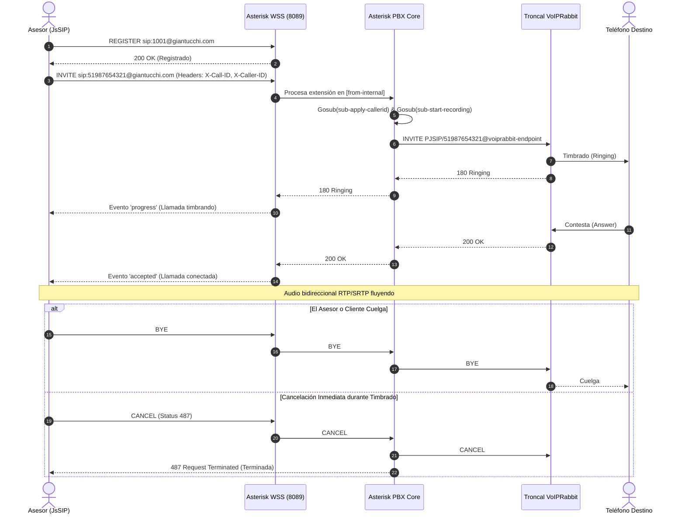

# 01. Arquitectura VoIP, WebRTC y Asterisk

Este documento detalla la infraestructura de voz, la capa de transporte SIP sobre WebSockets (WSS), la configuración del PBX Asterisk y la integración con la troncal mayorista.

---

## 1. Pila Tecnológica de Telefonía

- **Cliente WebRTC:** Librería `JsSIP` (v3.10+) ejecutada en el frontend de Chatwoot/AIRM (SPA Vue 3).
- **Transporte de Señalización:** `WSS` (Secure WebSocket) hacia `wss://voip.giantucchi.com:8089/ws` protegido por certificado TLS.
- **Servidor PBX:** Asterisk 20+ ejecutado en contenedor Docker con módulo `res_pjsip` y `res_pjsip_transport_websocket`.
- **Códecs de Audio:** `opus`, `alaw`, `ulaw` negociados mediante SDP (Session Description Protocol).
- **Troncal de Salida:** VoIPRabbit conectada por protocolo SIP (puerto 5060) mediante autenticación de credenciales y autorización de IP de origen.

---

## 2. Flujo de Señalización SIP



---

## 3. Configuración del Dialplan (`asterisk/extensions.conf`)

El archivo [asterisk/extensions.conf](file:///home/giantucchi/Proyectos/chatwoot/asterisk/extensions.conf) orquesta el enrutamiento:

### A. Pool de Caller IDs y Rotación Anti-Spam
```ini
[globals]
TRUNK_VOIPRABBIT=voiprabbit-endpoint
DEFAULT_CALLER_ID=51913086096
DID_POOL=51913086096,51913086097,51913086098

[sub-apply-callerid]
exten => s,1,NoOp(Calculando Caller ID desde el pool de rotacion)
 same => n,Set(TOTAL_DIDS=${FIELDNUM(DID_POOL,\,)})
 same => n,ExecIf($[${TOTAL_DIDS} < 1]?Set(TOTAL_DIDS=1))
 same => n,Set(RAND_INDEX=${RAND(1,${TOTAL_DIDS})})
 same => n,Set(SELECTED_CID=${CUT(DID_POOL,\,,${RAND_INDEX})})
 same => n,ExecIf($[${LEN(${SELECTED_CID})} < 3]?Set(SELECTED_CID=${DEFAULT_CALLER_ID}))
 same => n,Set(CALLERID(num)=${SELECTED_CID})
 same => n,Set(CALLERID(name)=${SELECTED_CID})
 same => n,Return()
```

### B. Enrutamiento Saliente para Perú y Prefijos Internacionales
- `_9XXXXXXXX`: Agrega automáticamente el código país `51` para números celulares de 9 dígitos.
- `_519XXXXXXXX`: Enrutamiento directo para números con prefijo 51 ya incluido.
- `_+X.`: Normaliza números con signo `+` retirando el prefijo para la troncal.
- `_X.`: Formato internacional general.

---

## 4. Control de Concurrencia y Redis State Machine

Para evitar colisiones entre asesores en cuentas con límite de concurrencia en la troncal (ej. 1 llamada simultánea):

1. Al iniciar llamada (`POST /api/v1/accounts/:id/voip/call_status` con `event: 'started'`), el backend actualiza una estructura Hash en Redis:
   ```ruby
   redis_key = "voip:account_#{account_id}:active_calls"
   redis.hset(redis_key, agent_id.to_s, call_data.to_json)
   redis.expire(redis_key, 3600)
   ```
2. Un job `ActionCableBroadcastJob` emite el evento `'voip.call_status_changed'` al canal de la cuenta:
   ```ruby
   ActionCableBroadcastJob.perform_later(
     ["account_#{account_id}"],
     'voip.call_status_changed',
     { active_calls: active_calls, event: event, agent_id: agent_id, ... }
   )
   ```
3. En el frontend, el componente [VoipDialer.vue](file:///home/giantucchi/Proyectos/chatwoot/app/javascript/dashboard/components/widgets/conversation/VoipDialer.vue) detecta si otro compañero está en llamada activa y muestra una alerta amarilla informando:
   > *"Línea ocupada por [Nombre del Asesor]. Llamando a [Teléfono]"*.
