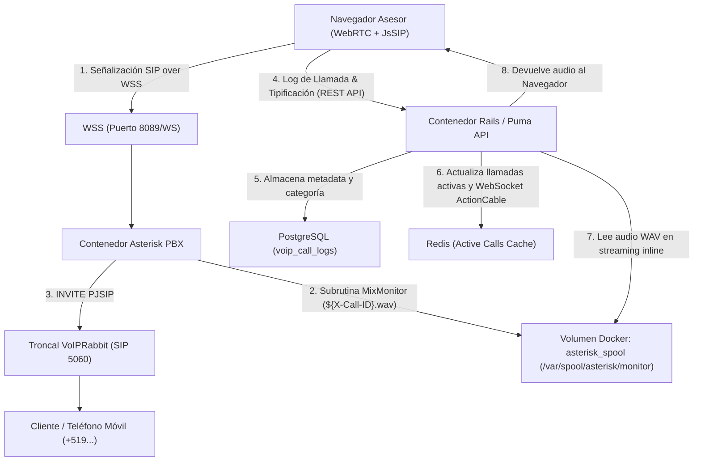

# 🛠️ Manual Técnico para Desarrolladores: Módulo VoIP Asterisk, Grabaciones y Reportería Avanzada

Este manual contiene la especificación técnica completa de la integración telefónica VoIP (WebRTC + Asterisk PBX), el sistema de grabación de llamadas en tiempo real, el flujo de tipificación dual y los dos nuevos módulos analíticos de **Click-to-call** y **Efectividad de Base de Datos**.

---

## 📑 Tabla de Contenidos

| Documento | Descripción |
| :--- | :--- |
| **[01. Arquitectura VoIP, WebRTC y Asterisk](file:///home/giantucchi/Proyectos/chatwoot/docs/developer/01_arquitectura_voip_webrtc_asterisk.md)** | Topología de red, señalización WSS (JsSIP), configuración de PJSIP y troncal SIP VoIPRabbit. |
| **[02. Grabaciones de Audio y Streaming](file:///home/giantucchi/Proyectos/chatwoot/docs/developer/02_grabaciones_audio_mixmonitor_streaming.md)** | Subrutina `[sub-start-recording]`, MixMonitor, volumen Docker `asterisk_spool` y streaming HTTP seguro. |
| **[03. Modelo de Datos y Migraciones](file:///home/giantucchi/Proyectos/chatwoot/docs/developer/03_modelo_datos_migraciones_custom_attributes.md)** | Tabla `voip_call_logs`, índices PostgreSQL, asociación a cuentas y atributo personalizado `tipificacion`. |
| **[04. API Endpoints, Rutas y Controladores](file:///home/giantucchi/Proyectos/chatwoot/docs/developer/04_api_controladores_rutas_seguridad.md)** | Controladores Rails `Api::V1::Accounts::VoipController`, autenticación, endpoints de reportes y streaming. |
| **[05. Frontend Vue, Helper y Componentes](file:///home/giantucchi/Proyectos/chatwoot/docs/developer/05_frontend_vue_dialer_reportes.md)** | `voipHelper.js`, cancelación inmediata (`early hangup`), `VoipDialer.vue` y vistas de reportes. |

---

## 🏗️ Diagrama de Arquitectura del Sistema



---

## ⚙️ Variables de Entorno Clave

Las siguientes variables son consumidas por Rails y Asterisk para la orquestación del servicio:

```dotenv
# Asterisk VoIP Configuration
ASTERISK_ENABLED=true
ASTERISK_WS_URL=wss://voip.giantucchi.com:8089/ws
ASTERISK_SIP_DOMAIN=giantucchi.com
ASTERISK_CALLER_ID=51913086096

# Troncal VoIPRabbit
VOIP_GATEWAY_IP=149.20.185.4
VOIP_CONCURRENCY_LIMIT=1
```

---

## 🚀 Despliegue y Mantenimiento
- Todos los cambios se integran en la rama principal `main`.
- El flujo de CI/CD en `.github/workflows/build-and-push-ghcr.yml` compila la imagen Docker de producción en GitHub Container Registry (`ghcr.io/datasch/airm:latest`) y dispara el webhook de Coolify automáticamente.
